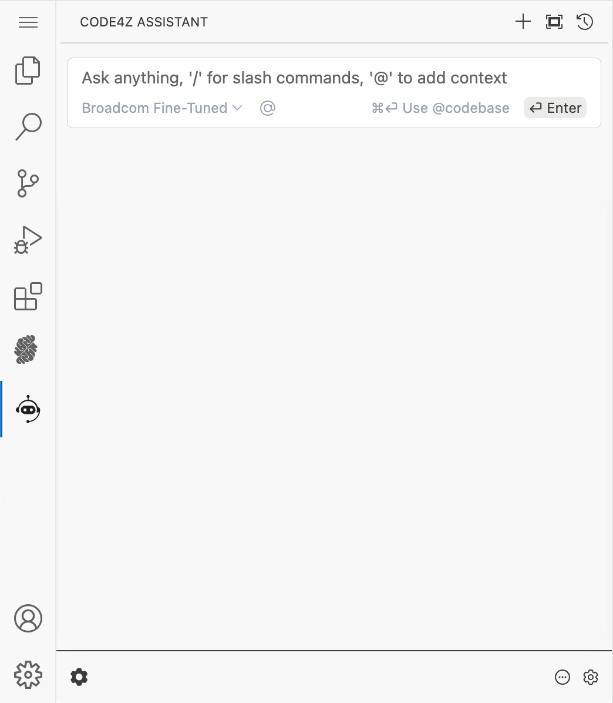
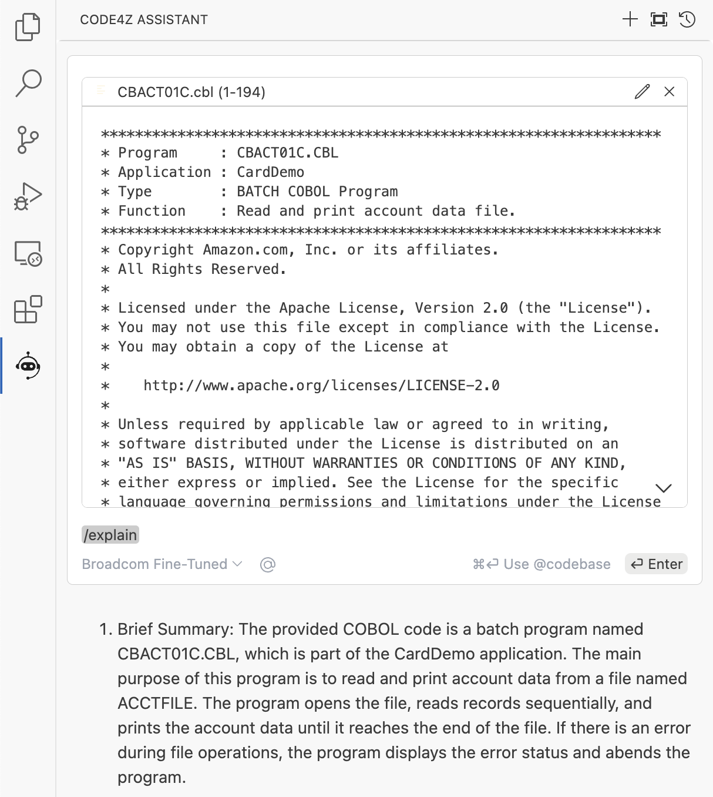
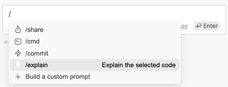
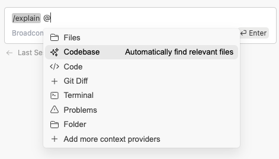
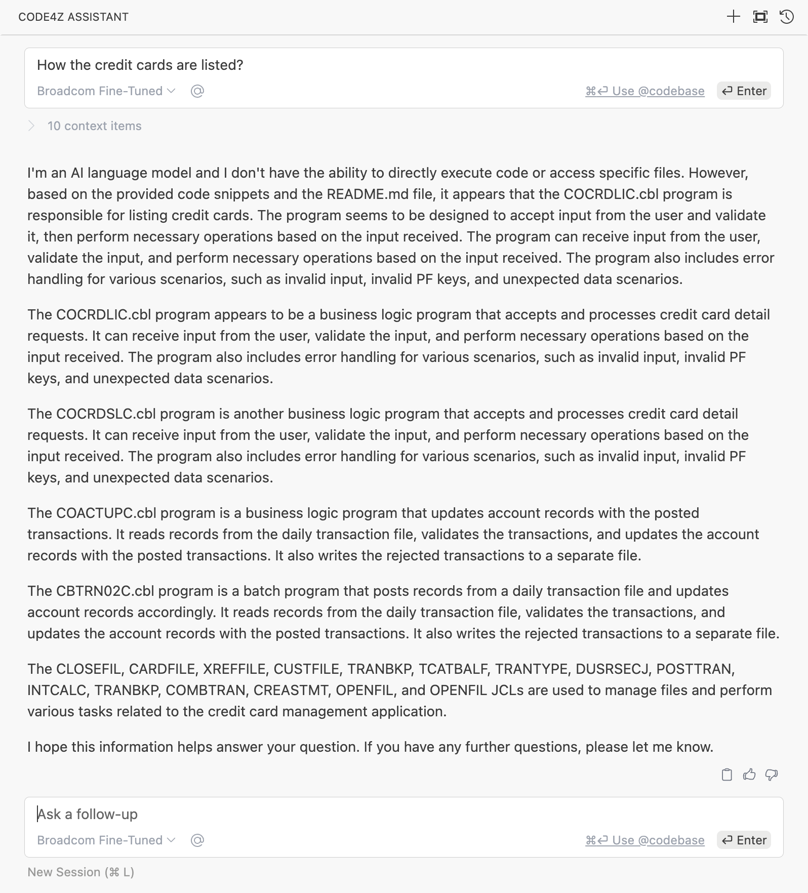

<!-- markdownlint-disable no-inline-html -->
# Code4z Assistant - Workshop Scenarios

## Initial Setup

The Code4z Assistant extension is used for this workshop. It is already installed and configured in your Code4z Assistant VS Extension.

To open the Code4z Assistant view, click its icon in the activity bar: 

This opens the following view: 

The workshop environment is ready to be used.

## Scenario 1: Code Explanation

The Code4z Assistant can explain COBOL code in a human-readable way. It uses natural language processing and machine learning techniques to generate explanations for the code.

You can explain sections of a program or entire programs.

Follow these steps:

1. Select a COBOL program from the Explorer view. For example, navigate to: `MODERNIZATION-CARDDEMO` / `app` / `CBACT01C.cbl`.

    

2. To select all code, click inside the editor, then press `⌘`+`A` on macOS or `Ctrl`+`A` on Windows.

    

   The selected code is displayed in a panel on the right side of the VS Code window.

3. In the Code4z Assistant view, Type `Explain` and press Enter.

    

   Code4z Assistant provides an explanation of the selected code in English.

    

4. Ask follow-up questions as required. You can also select a specific part of the code and repeat the explanation process to focus on that part. To add the selected code to the chat, press  `⌘`+`L` on macOS or `Ctrl`+`L` on Windows.

    

Please share your feedback for Scenario 1:

- Was the information provided accurate and useful?
- What parts of the code would you use the explanation on?

## Scenario 2: Codebase and Folder Explanation

When working with a large codebase, understanding the purpose of each module is crucial. This can be particularly challenging in applications that are extensive or lack up-to-date documentation.

The *Code4z Assistant* simplifies this process by generating detailed explanations for each module in the application. 

Follow these steps to leverage this feature:

1. Open the *Code4z Assistant* view.

2. In the chat box, type `/` and select the `/explain` command.

    

3. Then type `@` and select `Codebase` from the context menu.

    

    *Note:* Alternatively, you can choose the Folder option to focus on a specific folder for a detailed explanation.

4. Press `Enter` to initiate the explanation process. Note that while this may take longer than explaining a single code snippet, much of the groundwork has already been done during code indexing.

5. The output will appear in the chat window, providing a high-level overview of each folder and detailed explanations of individual modules.

We value your input and would love to hear your thoughts on this content!

- Does the content provide the clarity and guidance you need?
- Are there any sections that could be improved or made more useful?
- Do you have additional suggestions or ideas to enhance the experience?

## Scenario 3: Asking High-Level Questions about the Codebase

Code4z Assistant indexes your codebase, enabling it to automatically retrieve the most relevant context from across your workspace when you ask a question.

This retrieval is powered by an embeddings-based approach, which identifies and pulls in the specific parts of your code or documentation relevant to your English-language query.

Ideal for high-level questions about your codebase:

- “How are credit cards listed?”
- “What is the SQL query to update the …?”
- “Does this application use …?”

Not ideal for exhaustive file analysis:

- “Find every instance where the XYZ module is called.”
- “Review the entire codebase for spelling mistakes.”

Follow these steps:

1. Open the Code4z Assistant view.

2. Enter your question into the chat box.

3. Click the *@codebase* link below the input box or use a keyboard shortcut `⌘`+`Enter` on macOS or `Ctrl`+`Enter` on Windows.

    

We’d love your input on the following:

- Was the information provided accurate and useful?
- Was there a better way to provide context for your question?
- What specific questions about the codebase do you need help answering?

## Troubleshooting Tips

If you notice that progress has stalled in VS Code, try refreshing the window:

1. Press F1 to open the **Command Palette**
2. In the Command Palette, type `Reload Window` and press Enter.
   The VS Code window reloads.
